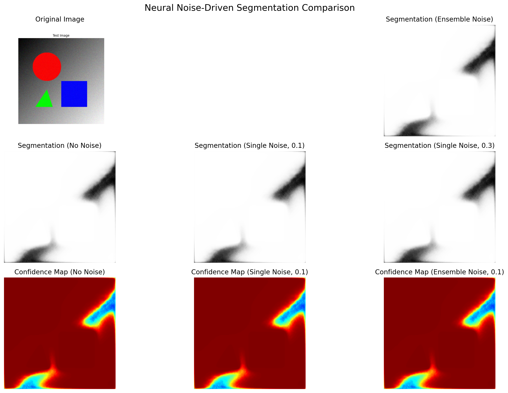

# Neural Noise-Driven Segmentation



[](https://opensource.org/licenses/MIT)
[](https://www.python.org/downloads/)
[](https://pytorch.org/)

A novel image segmentation system that leverages controlled neural noise to enhance segmentation accuracy, especially in ambiguous regions.

## 🚀 Key Features

- **Noise-Enhanced Segmentation**: Deliberate injection of controlled noise patterns to break symmetry and improve edge detection
- **Uncertainty Quantification**: Built-in uncertainty estimation through noise-based ensembling
- **Adaptive Noise Patterns**: Different noise types optimized for different network layers
- **Interactive UI**: Streamlit-based interface for parameter tuning and segmentation visualization
- **REST API**: FastAPI implementation for seamless integration with other systems

## 📋 Requirements

- Python 3.7+
- PyTorch 1.10+
- CUDA (optional, for GPU acceleration)
- See `requirements.txt` for full dependencies

## ⚙️ Installation

```bash
# Clone the repository
git clone https://github.com/yourusername/neural-noise-segmentation.git
cd neural-noise-segmentation

# Create a virtual environment (optional but recommended)
python -m venv .venv
# On Windows
.venv\Scripts\activate
# On Linux/Mac
source .venv/bin/activate

# Install dependencies
pip install -r requirements.txt

# Or install as a package
pip install -e .
```

## 🎮 Quick Start

The quickest way to get started is to use the provided quick start script:

```bash
# On Windows
.\quick_start.bat

# On Linux/Mac
python quick_start.py
```

This will:
1. Install required dependencies
2. Create sample images if needed
3. Launch the Streamlit app

## 💻 Usage

### Standalone Application

```bash
python -m streamlit run streamlit_app.py
```

### API Server

```bash
python -m uvicorn api.app:app --reload
```

### Integration with your code

```python
from models.noise_unet import NoiseAwareUNet
from utils.simple_noise_injector import NeuralNoiseInjector
import torch
from PIL import Image
import numpy as np

# Load model
model = NoiseAwareUNet(3, 1)
model.load_state_dict(torch.load("models/noise_unet_model.pth"))
model.eval()

# Configure noise injector
noise_injector = NeuralNoiseInjector(noise_scale=0.1)
model.noise_injector = noise_injector

# Process an image
def segment_image(image_path, noise_mode="single"):
    image = Image.open(image_path).convert("RGB")
    # Process image...
    # Apply model...
    return segmentation_mask, confidence_map
```

## Technical Architecture

### Core Innovation: Noise Injection Framework

The system introduces parameterized noise at specific layers of the segmentation pipeline to:

1. Break symmetry in ambiguous segmentation regions
2. Escape local optima during inference
3. Create ensemble-like effects with a single model
4. Generate probabilistic segmentation maps

### Implementation Details

```python
class NeuralNoiseInjector:
    def __init__(self, noise_scale=0.1, noise_decay=0.95, noise_patterns=["gaussian", "perlin", "simplex"]):
        self.noise_scale = noise_scale
        self.noise_decay = noise_decay
        self.noise_patterns = noise_patterns
        self.current_iteration = 0
        
    def inject_noise(self, feature_map, pattern_type=None):
        """Inject calculated noise into feature maps based on current segmentation state"""
        if pattern_type is None:
            pattern_type = random.choice(self.noise_patterns)
            
        # Calculate effective noise scale with decay
        effective_scale = self.noise_scale * (self.noise_decay ** self.current_iteration)
        
        # Generate appropriate noise pattern
        if pattern_type == "gaussian":
            noise = np.random.normal(0, effective_scale, feature_map.shape)
        elif pattern_type == "perlin":
            noise = self._generate_perlin_noise(feature_map.shape, effective_scale)
        elif pattern_type == "simplex":
            noise = self._generate_simplex_noise(feature_map.shape, effective_scale)
            
        # Apply noise with feature map-dependent scaling
        edge_map = self._calculate_edge_strength(feature_map)
        # Scale noise impact based on edge uncertainty
        scaled_noise = noise * edge_map * effective_scale
        
        self.current_iteration += 1
        return feature_map + scaled_noise
    
    def _calculate_edge_strength(self, feature_map):
        """Calculate where edges are uncertain and need noise help"""
        # Implementation using gradient magnitudes and uncertainty metrics
        # ...
```

### Modified U-Net Architecture

```python
class NoiseAwareUNet(nn.Module):
    def __init__(self, n_channels, n_classes, noise_injector=None):
        super(NoiseAwareUNet, self).__init__()
        self.n_channels = n_channels
        self.n_classes = n_classes
        self.noise_injector = noise_injector or NeuralNoiseInjector()
        
        # Standard U-Net components
        self.inc = DoubleConv(n_channels, 64)
        self.down1 = Down(64, 128)
        self.down2 = Down(128, 256)
        self.down3 = Down(256, 512)
        self.down4 = Down(512, 1024)
        self.up1 = Up(1024, 512)
        self.up2 = Up(512, 256)
        self.up3 = Up(256, 128)
        self.up4 = Up(128, 64)
        self.outc = OutConv(64, n_classes)
        
        # Noise injection gates
        self.noise_gates = nn.ModuleList([
            nn.Parameter(torch.tensor(0.5)) for _ in range(5)
        ])
    
    def forward(self, x, noise_mode="training"):
        # Encode path with noise injection
        x1 = self.inc(x)
        if noise_mode != "disabled":
            x1 = self.maybe_inject_noise(x1, 0, noise_mode)
            
        x2 = self.down1(x1)
        x2 = self.maybe_inject_noise(x2, 1, noise_mode)
        
        x3 = self.down2(x2)
        x3 = self.maybe_inject_noise(x3, 2, noise_mode)
        
        x4 = self.down3(x3)
        x4 = self.maybe_inject_noise(x4, 3, noise_mode)
        
        x5 = self.down4(x4)
        x5 = self.maybe_inject_noise(x5, 4, noise_mode)
        
        # Decode path (standard)
        x = self.up1(x5, x4)
        x = self.up2(x, x3)
        x = self.up3(x, x2)
        x = self.up4(x, x1)
        x = self.outc(x)
        
        return x
    
    def maybe_inject_noise(self, feature_map, gate_idx, noise_mode):
        """Apply noise conditionally based on learned gate values"""
        gate_value = torch.sigmoid(self.noise_gates[gate_idx])
        
        if noise_mode == "training":
            # During training, use gate value to determine noise application
            if random.random() < gate_value.item():
                return self.noise_injector.inject_noise(feature_map)
        elif noise_mode == "inference_ensemble":
            # During inference, run multiple noise patterns and average
            results = [feature_map]
            for pattern in self.noise_injector.noise_patterns:
                noisy_map = self.noise_injector.inject_noise(feature_map, pattern)
                results.append(noisy_map)
            return sum(results) / len(results)
            
        return feature_map
```

## API Features

1. **Noise Mode Selection**:
   - `disabled`: Standard segmentation
   - `single`: One noise pattern
   - `ensemble`: Multiple noise patterns averaged

2. **Uncertainty Visualization**: Heatmap showing segmentation confidence based on noise sensitivity

3. **Noise Strength Control**: User-adjustable parameter for heavier/lighter noise influence

4. **Monte Carlo Endpoint**: Run multiple noisy segmentations to quantify uncertainty

## Technical Benefits

1. **Improved Edge Detection**: Noise helps distinguish ambiguous boundaries by breaking symmetry.

2. **Self-Regularizing Properties**: The system learns which layers benefit from noise injection and automates the process.

3. **Uncertainty Quantification**: Noise variations provide natural uncertainty estimates for segmentation confidence.

4. **Memory-Efficient Ensembling**: Single model produces multiple outputs via different noise patterns.

5. **Adaptability to Domain Shift**: Noise patterns help generalize to unseen data distributions.

## Implementation Challenges

1. Learning optimal noise patterns and injection points requires careful tuning

2. Ensuring deterministic results when needed despite stochasticity

3. Balancing between helpful noise and destructive interference

4. Optimizing for real-time performance with multiple noise patterns